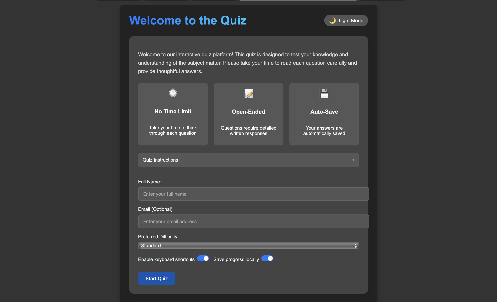

# Cheater Detection Quiz System



A sophisticated quiz platform with built-in cheating detection capabilities, designed to administer open-ended quizzes while identifying potential academic dishonesty through advanced similarity analysis.

## 🌟 Features

### Quiz Administration
- **Modern User Interface**: Clean, responsive design with both light and dark modes
- **Open-Ended Questions**: Support for detailed written responses
- **Auto-Save Functionality**: Prevents loss of progress during quiz taking
- **Navigation System**: Easy movement between questions with visual indicators
- **Progress Tracking**: Real-time progress indicators and completion statistics
- **Notes System**: Private note-taking capability for students
- **Question Flagging**: Mark difficult questions for later review


### Cheating Detection
- **Multi-Method Analysis**: Combines multiple similarity detection algorithms
- **Text Similarity Detection**: Uses difflib for common phrase identification
- **TF-IDF Vectorization**: Analyzes content similarity regardless of phrasing
- **Sentence Transformers**: Employs advanced NLP models to detect paraphrased content
- **Time Pattern Analysis**: Identifies suspicious timing correlations between submissions
- **Visual Results**: Clear visualization of detected similarities with highlighting


### Advanced Features
- **Keyboard Shortcuts**: Productivity enhancements for quiz navigation
- **Customizable Settings**: User preference options for quiz experience
- **Toast Notifications**: Non-intrusive feedback system
- **Detailed Statistics**: Comprehensive analytics on quiz completion
- **Data Export**: Export cheating analysis results for further review

## 🚀 Getting Started

### Prerequisites
- Python 3.8+
- Django 3.2+
- Required Python packages (see requirements.txt)

### Installation

1. Clone the repository:
```bash
git clone https://github.com/assaabriiii/Cheater-Detection.git
cd Cheater-Detection
```

2. Create and activate a virtual environment:
```bash
python -m venv venv
source venv/bin/activate  # On Windows: venv\Scripts\activate
```

3. Install dependencies:
```bash
pip install -r requirements.txt
```

4. Apply migrations:
```bash
python manage.py migrate
```

5. Create a superuser:
```bash
python manage.py createsuperuser
```

6. Run the development server:
```bash
python manage.py runserver
```

7. Access the application at http://127.0.0.1:8000/

## 📋 Usage

### Adding Questions
1. Log in to the admin interface at http://127.0.0.1:8000/admin/
2. Navigate to "Questions" and click "Add Question"
3. Enter the question text and number
4. Save the question

### Taking the Quiz
1. Visit the welcome page and enter your name
2. Navigate through questions using the navigation dots or arrow buttons
3. Your answers are automatically saved as you type
4. Complete all questions and submit

### Analyzing Cheating
1. After students complete the quiz, access the cheating analysis page
2. Review suspicious pairs sorted by severity
3. Examine highlighted matching phrases and similarity scores
4. Use filtering and sorting options to focus on specific cases
5. Export results for further review if needed


## 🔧 Technical Details

### Similarity Detection Methods

1. **Text Difference Similarity**
   - Uses Python's difflib to identify common sequences of text
   - Calculates similarity based on matching blocks of text

2. **TF-IDF Cosine Similarity**
   - Converts text to TF-IDF vectors
   - Measures cosine similarity between vectors
   - Effective for detecting content similarity despite different wording

3. **Sentence Transformer Similarity**
   - Utilizes pre-trained sentence transformer models
   - Generates semantic embeddings of text
   - Compares embeddings to detect paraphrased content

4. **Time Pattern Analysis**
   - Analyzes time spent on each question
   - Calculates correlation between students' timing patterns
   - Flags suspicious timing similarities

### Architecture
- Django web framework for backend
- Vanilla JavaScript for frontend interactivity
- SQLite database for data storage (configurable for other databases)
- Sentence Transformers for advanced NLP analysis

## 📊 Project Structure

```
quiz_project/
├── quiz/
│   ├── static/
│   │   └── quiz/
│   │       └── style.css
│   │   
│   ├── templates/
│   │   └── quiz/
│   │       ├── base.html
│   │       ├── welcome.html
│   │       ├── quiz.html
│   │       └── cheaters.html
│   ├── templatetags/
│   │   └── cheater_tags.py
│   ├── migrations/
│   ├── admin.py
│   ├── apps.py
│   ├── check.py
│   ├── models.py
│   ├── tests.py
│   ├── utils.py
│   └── views.py
├── quiz_project/
│   ├── settings.py
│   ├── urls.py
│   ├── wsgi.py
│   └── asgi.py
├── results.json
├── manage.py
└── requirements.txt
```

## 🔄 Future Improvements

- **Machine Learning Integration**: Enhanced cheating detection with ML models
- **Real-time Monitoring**: Live monitoring of student activity during quizzes
- **API Integration**: Connect with LMS systems via API
- **Additional Question Types**: Support for multiple-choice and other question formats
- **Peer Review**: Allow instructors to review flagged submissions

## 🤝 Contributing

Don't.